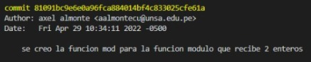

<table>
    <theader>
        <tr>
            <td></td>
            <th>
                UNIVERSIDAD NACIONAL DE SAN AGUSTIN 
                FACULTAD DE INGENIERÍA DE PRODUCCIÓN Y SERVICIOS 
                ESCUELA PROFESIONAL DE INGENIERÍA DE SISTEMAS
            </th>
            <td></td>
        </tr>
    </theader>
    <tbody>
        <tr><td colspan="3">Formato: Guía de Práctica de Laboratorio / Talleres / Centros de Simulación</td></tr>
        <tr><td>Aprobación:  2022/03/01</td><td>Código: GUIA-PRLD-001</td><td>Página: 1</td></tr>
    </tbody>
</table>

INFORME DE LABORATORIO 
(formato estudiante)

<table>
<theader>
<tr><th colspan="6">INFORMACIÓN BÁSICA</th></tr>
</theader>
<tbody>
<tr><td>ASIGNATURA:</td><td colspan="5">Programación Web 2</td></tr>
<tr><td>TÍTULO DE LA PRÁCTICA:</td><td colspan="5">Git - GitHub</td></tr>
<tr>
<td>NÚMERO DE PRÁCTICA:</td><td>01</td><td>AÑO LECTIVO:</td><td>2022 A</td><td>NRO. SEMESTRE:</td><td>III</td>
</tr>
<tr>
<td>FECHA DE PRESENTACIÓN:</td><td colspan="2">29-Abr-2022</td><td>HORA DE PRESENTACIÓN:</td><td colspan="2">9:30</td>
</tr>
<tr><td colspan="4">INTEGRANTE (s):
<ul>
<li>Diaz/Portilla, Carlo Rodrigo</li>
<li>Moroccoire/Pacompia, Anthony Marcos</li>
<li>Ticona/Hareth, Anthony Joaquín</li>
<li>Almonte/Cuba, Axel Frank</li>
<li>Chaisa/Fernández, Anthony Leonel</li>
</ul>
</td>
<td>NOTA:</td><td>Pendiente</td>
</tr>
<tr><td colspan="6">DOCENTES:
<ul>
<li>Richart Smith Escobedo Quispe (rescobedoq@unsa.edu.pe)</li>
</ul>
</td>
</tr>
</tbody>
</table>
<table>
<theader>
<tr><th>SOLUCIÓN Y RESULTADOS</th></tr>
</theader>
<tbody>
<tr><td>I. SOLUCIÓN DE EJERCICIOS/PROBLEMAS 
A. Repositorios del trabajo individual:
<ul>
<li>https://github.com/CarloDiazP/laboratorio01</li>
<li>https://github.com/AnthonyMTH/primero</li>
<li>https://github.com/AxelAlmonteCuba/pwb2</li>
<li>https://github.com/ianthony4/Pweb2</li>
<li>https://github.com/amoroccoire/pw2.git</li>
</ul>
B. Solución trabajo grupal: 
 1. Para iniciar, un integrante creó un repositorio GitHub en el que todos trabajarán en sus respectivas ramas
 2. Luego el dueño del repositorio crea un archivo base <code>Calculadora.java</code> del cual los demás integrantes crearon ramas para poder trabajar las funciones les fueron asignadas.

 
 3. Cada integrante creo su propia rama la cual llamaron por su nombre GitHub

 4. Cada integrante hizo commit de su función asignada

 
 5. Luego de hacer los commits, se realizó un push a cada una de las ramas

 6. Para finalizar, se hizo merge de todas las ramas con la rama principal <code>main</code>.

</td></tr>
<tr><td>II. SOLUCIÓN DEL CUESTIONARIO 
A. ¿Por qué Git es una herramienta importante en el curso de Programación Web 2? 
Respuesta:  
Porque facilita la creación de programas de manera grupal, promoviendo el trabajo colaborativo, pudiendo trabajar asíncronamente en la creación y ejecución de proyectos, además de otorgar infinitas posibilidades con la revisión y el seguimiento del programa entre los miembros de un grupo, y proporcionar una relación docente - estudiante clara y sencilla.</td></tr>
<tr><td>III. CONCLUSIONES
<ul>
<li>
Git es una herramienta bastante útil para el aprendizaje, ya que permite el fácil intercambio de información entre programadores de todo el mundo.
</li>
<li>
El trabajo en equipo en Git es óptimo. Si bien puede ser algo complejo al principio, cuando se llega a entender las conexiones, el funcionamiento entre las ramas, el trabajo grupal se torna sencillo, agradable y funcional.
</li>
</ul>
</td></tr>
</tbody>
</table>
<table>
<theader>
<tr><th>RETROALIMENTACIÓN GENERAL</th></tr>
</theader>
<tbody>
<tr><td>I. RETROALIMENTACIÓN:</td></tr>
<tbody>
</table>
<table>
<theader>
<tr><th>REFERENCIAS Y BIBLIOGRAFÍA</th></tr>
</theader>
<tbody>
<tr><td>I. BIBLIOGRAFÍA
<ul>
<li>https://git-scm.com/book/es/v2</li>
</ul>
</td></tr>
</tbody>
</table>
